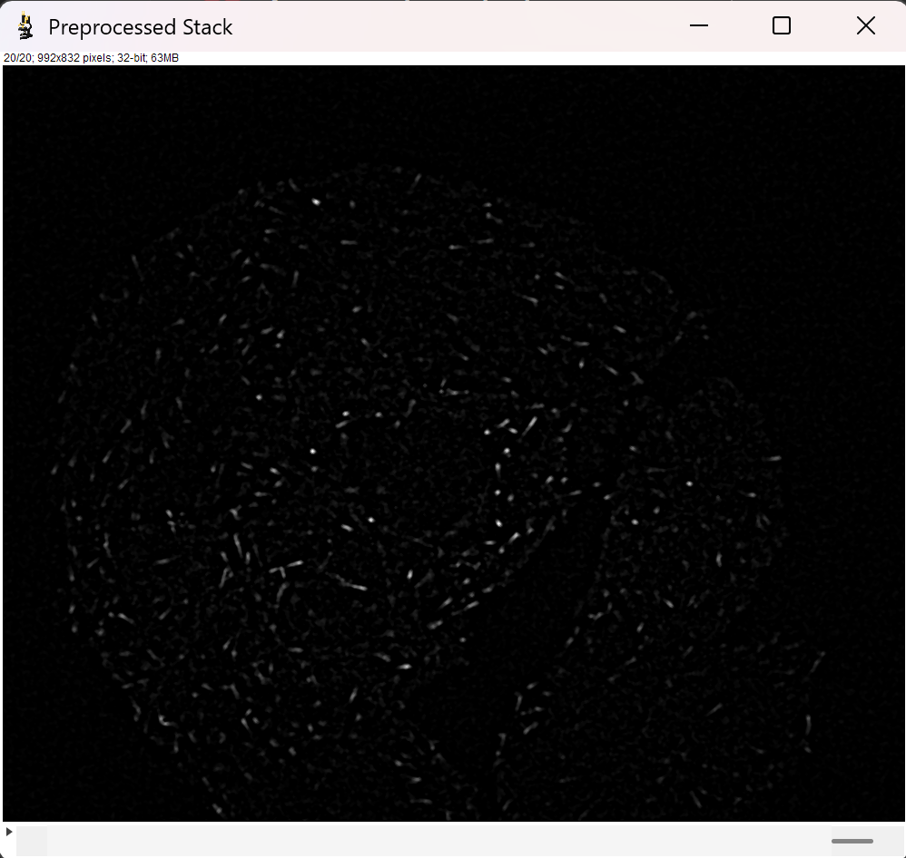

# MiTrack : Tracking of Microtubule End Binding Protein 

**Authors:** Gabrielle Blouvac & Charlotte Daumal   
**Context:** This project was completed as part of the *Bioimage Informatics* course taught by Prof. Daniel Sage & Prof. Arne Seitz at EPFL  
**Language:** Java  
**Date:** June 2025

---

## 📖 Project Overview 

This plugin has been developed to allow for a fast and efficient way to 
track fluorescently tagged EB-3 proteins (End Binding protein 3) in a cell to study microtubule dynamics.
In this plugin was included : 
- Methods to increase the contrast with temporal summing of frames
- Segmentation and tracking algorithm of the microtubules
- Methods to compute the average or instantaneous speed and orientation of extending microtubules 
- Quantitative plots generation of speed and orientation distributions
- Coloring methods to visualise speed changes or orientation of the trajectories

> [!WARNING] 
> ⏰ Please note that depending on the file you run and the amount of frames, the plugin may be slow.
> For a 400 frames image, it may take up to a few minutes of runtime. Be also aware of the fact that the tracking is computationally 
> intensive and thus require to access your RAM without limitations, which is why it may not work on IntelliJ directly 
> because of the limited RAM access. 
> If you encounter `Out-Of-Memory` error, try running the plugin on Fiji instead or increase the memory allocated to 
> IntelliJ on your computer :)

---

## ⚙️ How to use it ? 

### Installation
Install the .jar file named `eb-3-project-1.0.0.jar` into your `Fiji.app > plugins` folder and restart Fiji to 
finish the installation of the plugin.

This does not require any additional package or dependencies to work aside from the core ImageJ functionalities.

### Plugin data
This plugin was designed to segment and track microtubules extending. It was 
developed based on fluorescently tagged EB-3 cells.
The software exploits the difference in intensity between the background and the 
fluorescent proteins to track microtubule dynamics and thus should be used for 
fluorescence images with similar characteristics. 
As MiTrack was specifically designed to track extending microtubules, 
a few assumptions were made in the tracking, mainly being : 
- EB3 comets do not change directions and have no curvature 

> Any type of file (8, 16 or 32-bits) with a single channel is accepted. The image should be a 2D stack, with a time axis. 
> The speed units computed are only correct for input data where the scale of pixels is the 
> same in x and y directions.

### Step by step explanation
Once the package has been installed, launch the plugin from the Fiji 
plugin menu in `BII>MiTrack`. 

1) Select the file you want to analyze.
    > 📝 NOTE: Please convert your image to grayscale first. 
2) Apply the Preprocessing parameters you want to enhance your image
3) Then select the Segmentation and Tracking parameters fit to your application
4) Finally select Display & Debugging options.

> [!WARNING] 
> ⏰ Please note that depending on the size of the file you run, 
> the different display options you selected and 
> the parameters chosen to compute,
> the time of execution of the code **may vary**. 

### How to choose the right parameters ? 
Here is a short description of the different parameters of the plugin, with 
specific recommendations of values. 

#### 1) Preprocessing parameters:
As a preprocessing of the image, we propose to increase EB3 comets visualisation by projecting frames on a sliding 
window along the time axis. The type of projection we use here is equivalent to the "sum" ZProjector on Fiji. Then to 
segment the image easily, we implemented a function that subtracts the previous frame to the current frame to transform
the comet streaks into point corresponding to the head of the comet.

> 🛎️ IMPORTANT NOTE: The temporal projection used to enhance our image takes the n-previous frames (as selected by the `WindowExp` parameter, 
> see below). This means that the first n-frames are "sacrificed" for the final output, because they do not have 
> the projection of the previous n frames as the other frames do. 

We also use a DoG filter to remove background and increase contrast of the structures of interest. A median filtering 
of radius 1 is then applied to have sharper images without impacting the objects structure too much. Select parameters 
tuned specifically to your image to improve visualisation in the following ways :
- `sigma1` : parameter of the gaussian blur to remove the background structure.
- `sigma2` : parameter of the gaussian blur to keep the structures of interest. 
    > To visualise this intermediate result, please select the option `Display` in the Preprocessed Stack menu.
- `WindowExp` : parameter to select the number of frames that will be added to increase
    the contrast. We typically recommend values between 1 and 3 to avoid over-saturation of pixels.

> 💡 TIP:
> To increase contrast between microtubules signal and background,
  temporal addition of frames is **strongly recommended**. Select the temporal
  exposure parameter to select how many frames are summed to increase the contrast.

#### 2) Segmentation parameters:

Our segmentation approach is then based on local maxima detection using a DoG filter and depends on the 
following parameters :
- `sigma` : segmentation is based on a classical 
DoG filter that approximates a LoG filter. This sigma
controls the level of blur and edge detection applied
by the DoG. It should be calibrated depending on the approximate 
size of the microtubule objects (ranging from 1 to a few pixels)
    > 💡 TIP: 
    > Gaussian blur affects
    > an area of approximately 6 * sigma in size (3 sigma radius in each direction).

- `threshold` : The intensity value above which a microtubule is detected, **applied to the `Temporal Projection` 
image**.
    > 💡 TIP:
    > To select an appropriate threshold, let your mouse hover above the dots on the `Temporal Projection` 
    > image to find a good threshold to separate the microtubule dots from the background. Use the `Preview Detection`
    > button to visualize how good your segmentation parameters are.
    
#### 3) Tracking Parameters:
Tracking is done based on the assumptions we have stated above, with the parameters described below :

> 🖇️ Cost Options:
> First select the tracking method that you want to use : either with or without a cost applied to instantaneous changes
> in the microtubule speed. To study dynamics, not using speeds in the cost is preferable to avoid bias in the data. 
> However, do note that the tracking will be less effective and accurate as adding this condition allows to prevent 
> tracking together different but close-by trajectories that go in the same direction.

- `costmax` : the maximum cost we allow for tracking together two spots of two succeeding frames. 
It can take any value. You should tune this parameter depending on the trajectories you obtain : too many 
aberrant trajectories, reduce the costmax ; too few trajectories appear, increase the costmax.
- `lambda`: the weight of the distance between two spots to track them together.
- `gamma`: the weight of the direction change between two spots to track them together.
- `kappa`: the weight of the speed change between two spots to track them together. 

> 📝 NOTE: the intensity difference between two spots also plays a part in linking them together during the 
> tracking assignment. Intensity difference carries a weight of `1-lambda-gamma-kappa`.

### 4) Results options 
Here you can select different display options and collect data from the tracking results. 

- Coloring of the trajectories: 
  - Randomly 
  - According to Speed : color of the trajectories represent the instantaneous speed at every frame.
  - According to the Orientation : 
    Either using the Global orientation (computed from the first and last point of the trajectory) or the average local
    orientation computed between every pair of following points in the trajectory. 

- Results : 
  - The average speed distribution : a histogram plot that contains all the average speed of the trajectories 
  - The speed evolution against time : to visualize speed changes dynamics of the top `N` longest trajectories
  - The average orientation distribution : a histogram plot that contains all the global average orientations for all
    the trajectories. 

### 5) And finally the Advanced Options !
This serves as a debugging method to show all the intermediate results and prints of the algorithm to allow 
for problem-solving.

---

## 🦠 Expected outputs 

Here is a short description and examples of the kind of results we can obtain using MiTrack.

### 1) Preprocessing steps 

The original image we used was very noisy, with a bright background that impaired clear 
visualisation of the microtubules' dynamics.

After the first preprocessing, we remove the background structure in the image : 

Here we can observe the extending microtubules easier, however their intensity values remain
small so to increase them, we go through the next steps that combine a temporal sum and difference 
projection to increase intensity and render the comets closer to dots.

### 2) Segmentation 

Now that we have preprocessed our image, we can go to the segmentation ! 

Segmentation detects individual objects and the results can be shown as such : 

If satisfied with the segmentation, we can proceed with the final step, the tracking of the objects trajectories. 

### 3) Visualization of trajectories

Here we have the final trajectories, that can be colored with or without the color orientation map (as seen below).

Random coloring : 

 

Coloring with the orientation or instantaneous speeds : 

 

### 4) Speed and orientation plots 

Using the tracking data some plots that analyse quantitatively the trajectories and their dynamics can also be generated :

Distribution of the average orientations : 

Distribution of the average speeds and speed dynamics against time for the top 5 longest trajectories :

 

---

## License

This project is for educational purposes.  
Content © Gabrielle Blouvac & Charlotte Daumal. Academic use only.
