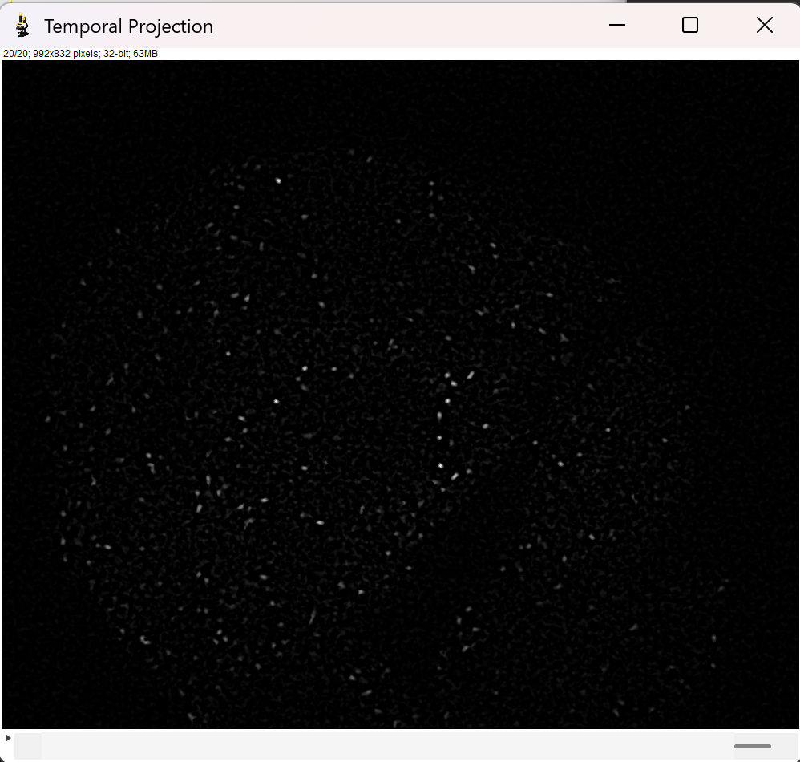
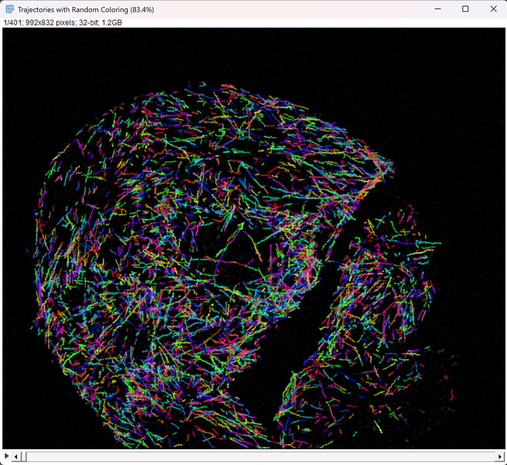
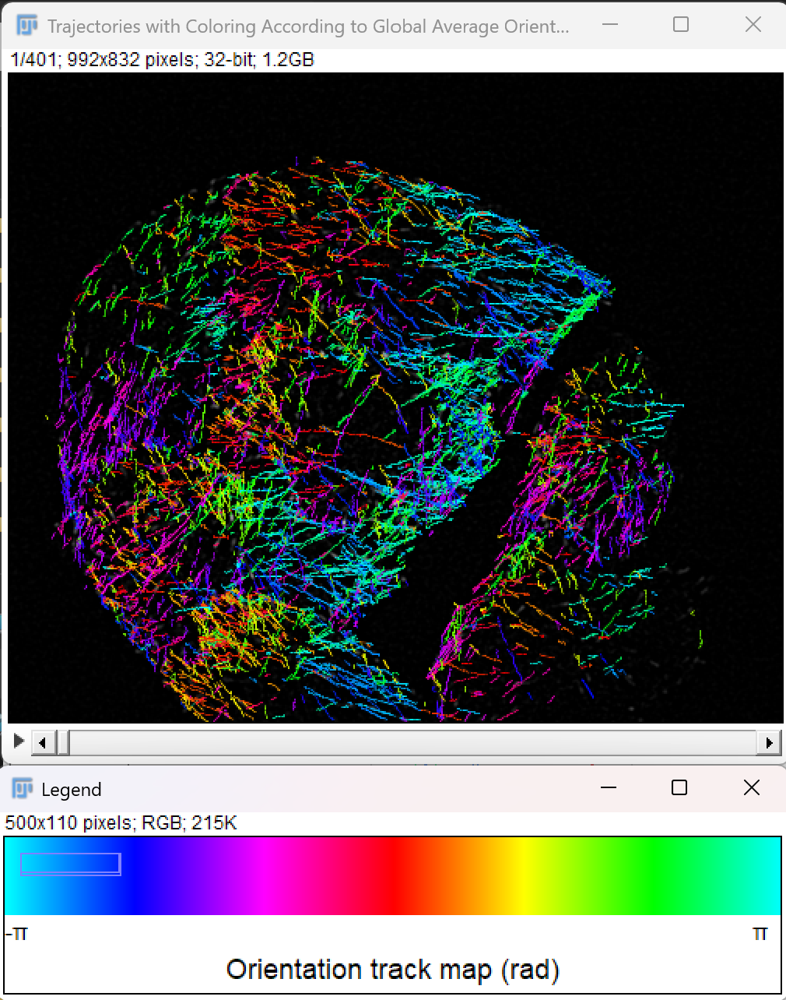

# 🦠 MiTrack : Tracking of Microtubule End Binding Protein 

## 📖 Description 

This plugin has been developed to allow for a fast and efficient way to 
track fluorescently tagged EB-3 proteins in a cell to study microtubule dynamics.
In this plugin was included : 
- color coding of the trajectories according to the orientation
- computation of the microtubule speed 

## ⚙️ How to use it ? 

### Installation
- include dependencies

### Plugin data
This plugin was designed to segment and track microtubules extending. It was 
developed based on fluorescently tagged EB-3 cells.
The software exploits the difference in intensity between the background and the 
fluorescent proteins to track microtubule dynamics and thus should be used for 
fluorescence images with similar characteristics. 
As MiTrack was specifically designed to track extending microtubules, 
a few assumptions were made in the tracking : 
- EB3 comets do not change directions and have no curvature 
- the microtubule speed remains constant

>Any type of file (8, 16 or 32-bits) is accepted.

### Step by step explanation
Once the package has been installed, launch the plugin from the Fiji 
plugin menu in `BII>MiTrack`. 

1) Select the file you want to analyze.
    > 📝 **NOTE:** Please convert your image to grayscale first. 

2) Choose the parameters you require (see how to choose your parameter list below).
3) Select Display & Debugging options.

> **⏰** Please note that depending on the size of the file you run, 
> the different display options you selected and 
> the parameters chosen to compute,
> the time of execution of the code **may vary**. 

### Choosing the parameters 
Here is a short description of the different parameters of the plugin, with 
specific recommendations of values. 

#### Preprocessing parameters:
As a preprocessing of the image, we propose to increase EB3 comets visualisation by projecting frames on a sliding 
window along the time axis. The type of projection we use here is equivalent to the "sum" ZProjector on Fiji. 
We also use a DoG filter to remove background and increase contrast of the structures of interest. A median filtering 
of radius 1 is then applied to have sharper images without impacting the objects structure too much. Select parameters 
tuned specifically to your image to improve visualisation in the following ways :
- `sigma1` : parameter of the gaussian blur to remove the background structure.
- `sigma2` : parameter of the gaussian blur to keep the structures of interest. 
- `number of frames` : parameter to select the number of frames that will be added to increase
    the contrast. We typically recommend values between 1 and 5 to avoid over-saturation of pixels.

> 💡 **TIP:** To increase contrast between microtubules signal and background,
  temporal addition of frames is **strongly recommended**. Select the temporal
  exposure parameter to select how many frames are summed to increase the contrast.

#### Segmentation parameters:
Our segmentation approach is based on local maxima detection using a DoG filter and depends on the 
following parameters :
- `sigma` : segmentation is based on a classical 
DoG filter that approximates a LoG filter. This sigma
controls the level of of blur and edge detection applied
by the DoG. It should be calibrated depending on the approximate 
size of the microtubule objects (ranging from 1 to a few pixels)
    > 💡 **TIP:** Gaussian blur affects
    > an area of approximately 6 * sigma in size (3 sigma radius in each direction).

- `threshold` : The intensity value above which a microtubule is detected. 
    
#### Tracking Parameters:
Tracking is done based on the assumptions we have stated above, with parameters described below :
- `costmax` : the maximum cost we allow for tracking together two spots of two succeeding frames. 
It can take any value. You should tune this parameter depending on the trajectories you obtain : too many 
aberrant trajectories, reduce the costmax ; too few trajectories appear, increase the costmax.
- `lambda`: the weight of the distance between two spots to track them together.
- `gamma`: the weight of the direction change between two spots to track them together.
- `kappa`: the weight of the speed change between two spots to track them together. 

> Note that the intensity difference between two spots also plays a part in linking them together during the 
> tracking assignment. Intensity difference carries a weight of `1-lambda-gamma-kappa`.

### Display & Debugging options 

# here explain what display options we have ex. color orientation legend etc

## 🛸 Expected outputs 

Here is a short description and examples of the kind of results we can obtain using MiTrack.

### Preprocessing steps 

The original image we used was very noisy, with a bright background that impaired clear 
visualisation of the microtubules' dynamics.

After the first preprocessing, we remove the background structure in the image : 

Here we can observe the extending microtubules easier, however their intensity values remain
small so to increase them, we go through the next steps that combine a temporal sum and difference 
projection to increase intensity and render the comets closer to dots.

### Segmentation 

Now that we have preprocessed our image, we can go to the segmentation ! 

Segmentation detects individual objects and the results can be shown as such : 

If satisfied with the segmentation, we can proceed with the final step, the tracking of the objects trajectories. 

### Final outputs 

Here we have the final trajectories, that can be colored with or without the color orientation map (as seen below).

 

### Speed and orientation plots 

